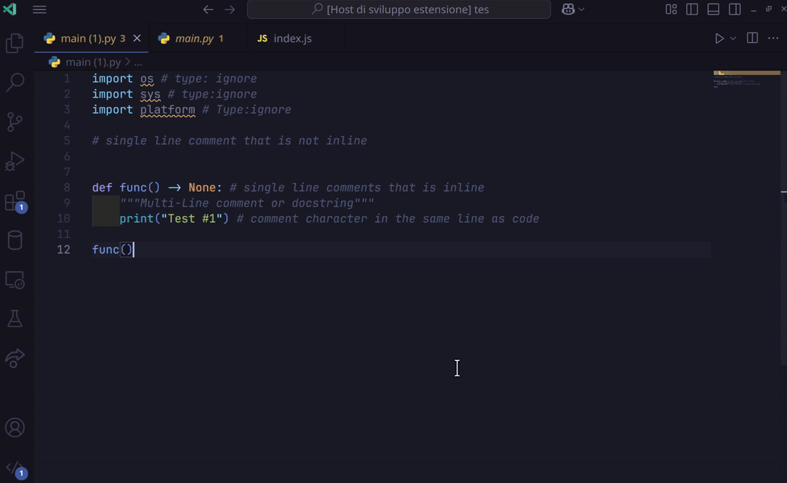

# remove-all-comments

This extension helps developers by removing all comments from their codebase, making it easier to clean up and streamline their projects.

## Features

- Remove all comments from the current file with a single command.
- Remove comments from all files in a selected folder.
- View a list of recently modified files with options to revert changes or view differences.
- Supports JavaScript, TypeScript, Python, and other common programming languages.
- Smarter than other extensions: it preserves useful comments like `//eslint-disable-next-line` and clears the line if the comment is on a whole line.
- Shows a diff at the end using the same interface as the built-in diff tool to correct any mistakes.
- Provides a command to remove comments from the current file or all files in a folder.

## Usage

Below is an example of how to use the extension.

## Requirements

- Visual Studio Code version 1.98.0 or higher.
- Node.js version 16 or higher.

## Extension Settings

This extension does not currently add any custom settings. Future updates may include configurable options for comment removal behavior.

## Known Issues

- Comments within strings or template literals may not be removed correctly in some cases.
- Large files or folders with many files may take longer to process.

## Contributing

Contributions are welcome! If you'd like to help improve this extension, you can:

- Update the exclude patterns to support additional programming languages.
- Report bugs or suggest features by opening an issue on the project's GitHub repository.
- Submit pull requests with your improvements or fixes.

Guidelines for Contributing

### Guidelines for Contributing

1. **Updating Exclude Patterns**  
   - Ensure that the changes are well-tested and do not interfere with existing functionality.
   - Include examples and test cases for any new language support.

2. **Reporting Issues**  
   - Clearly describe the issue, steps to reproduce it, and any relevant details.

3. **Submitting Pull Requests**  
   - Follow the project's coding standards and ensure your code is clean and well-documented.
   - Provide a clear description of the changes and their purpose.

4. **Testing**  
   - Test your changes thoroughly before submitting.
   - If possible, include automated tests to verify the functionality.

Thank you for contributing to "remove-all-comments"!

**Enjoy using the "remove-all-comments" extension!**
